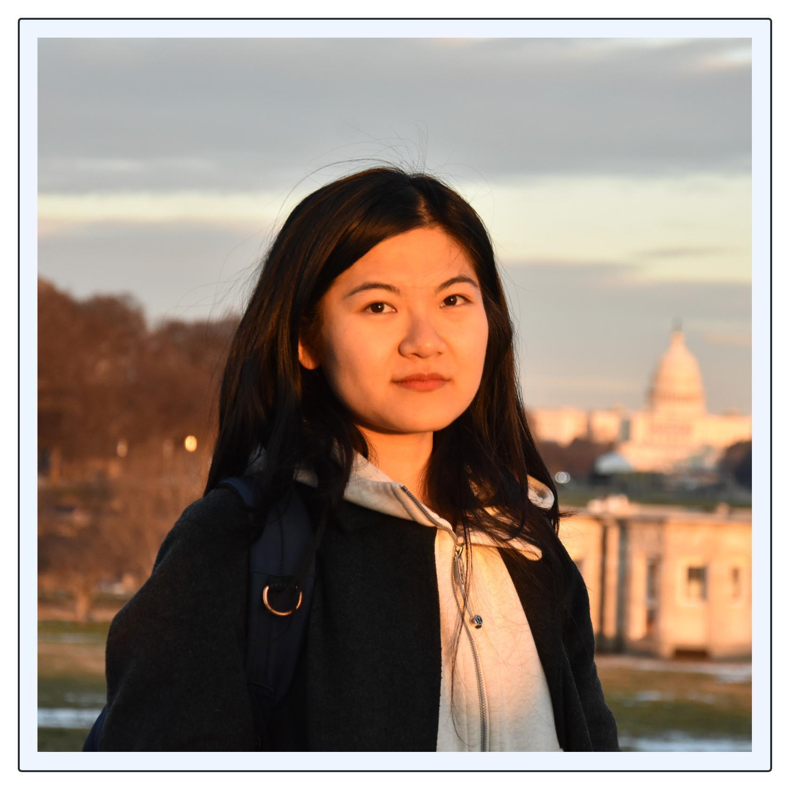

**PI: Constance Crozier**

<h2>Current PhD Students</h2>

**Rina Davila Severiano**

* Start date: Fall 2023
* Research area: Electrified freight transportation
* Publications: [NAPS '25]()

**Xiangxin An**

{: style="float: left"}
Some text.

* Co-supervisor: Santanu Dey
* Start date: Fall 2024
* Research area: Discrete actions within power system operation

<h2>Current MS Students</h2>

**Yiru Ji**

* Start date: Spring 2025
* Research area: Battery swapping for electric freight

<h2>Collaborating PhD Students</h2>

**Caleb Ju**

* Supervisor: George Lan
* Research area: Energy applications of reinforcement learning
* Publications: [HICSS '25]()
* [Personal website](https://jucaleb4.github.io) 